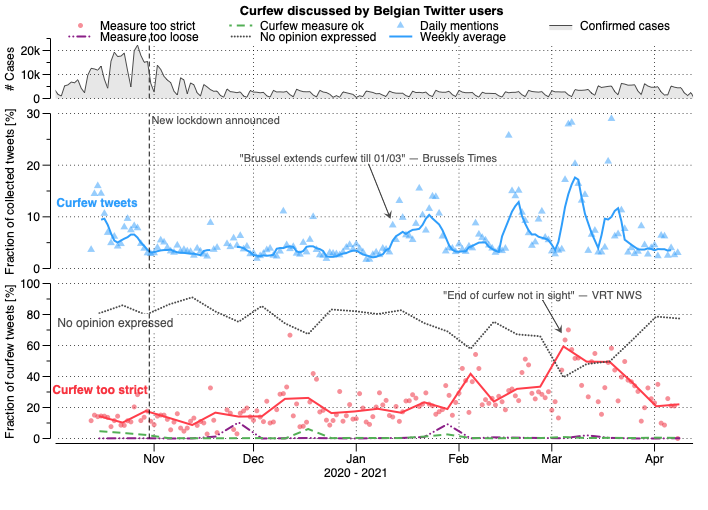

# Measuring Shifts in Attitudes Towards COVID-19 Measures in Belgium Using Multilingual BERT
Official codebase of the paper "Measuring Shifts in Attitudes Towards COVID-19 Measures in Belgium Using Multilingual BERT"  
Paper here: http://arxiv.org/abs/2104.09947. 

Included in this repository is the script used to pull Belgian COVID Tweets using the Twitter API. Given that the location field in Twitter is a free-form input and that some users do not use this feature, we relied on the occurrences of 'Belgium', translated versions and Unicode emoji flag in the location and free-form description field and the occurrence of a city or region in the location (we queried DBPedia for Dutch, French and English names of cities (e.g. 'Leuven') and regions (e.g. 'Flanders').

We categorized several months worth of these Tweets by topic (government COVID measure) and opinion expressed. Below is a timeline of the relative number of Tweets on the curfew topic (middle) and the fraction of those Tweets that find the curfew too strict, too loose, or a suitable measure (bottom), with the number of daily cases in Belgium to give context on the pandemic situation (top).

Models used in this paper are on Hugging Face:  
https://huggingface.co/DTAI-KULeuven/mbert-corona-tweets-belgium-curfew-support  
https://huggingface.co/DTAI-KULeuven/mbert-corona-tweets-belgium-topics  

A blog post about or results can be found here:  
https://people.cs.kuleuven.be/~pieter.delobelle/attitudes-towards-covid-19-measures/
